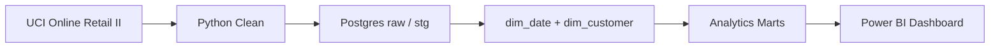

# Retail Retention & Revenue Intelligence

End-to-end retail analytics platform on **1M+ real online transaction records** — cohort retention, RFM segmentation, revenue concentration, and customer inactivity analysis with executive recommendations.

**Status:** Cohort retention analysis implemented

---

## Overview

Built an analytics pipeline using **Python**, **SQL**, **Postgres**, and **Power BI** to analyze customer retention, repeat purchase behavior, and revenue risk for a UK-based online retailer.

| | |
|---|---|
| **Dataset** | [UCI Online Retail II](https://archive.ics.uci.edu/dataset/502/online+retail+ii) |
| **Records** | ~1,067,371 transaction rows |
| **Period** | December 1, 2009 – December 9, 2011 |
| **Business** | UK non-store giftware retailer |

---

## Business Problem

A UK online retailer needs to understand who returns, who goes inactive, where revenue is concentrated, and which customer segments to target for win-back or loyalty campaigns.

Full framing: [docs/business_problem.md](docs/business_problem.md)

---

## Tech Stack

- **Python** — ingest, clean, validate, export marts
- **SQL** — analytical logic (25+ queries)
- **Postgres** — data warehouse
- **Power BI** — 6-page executive dashboard
- **GitHub** — version control and portfolio delivery

---

## Architecture



**Data lineage:** `raw` → `stg_transactions` → `dim_*` / `fct_*` → `mart_*` → Power BI

---

## Dashboard Preview

*(Screenshots coming Week 2 — Days 10–12)*

| Page | Focus |
|------|--------|
| 1 | Executive Revenue Overview |
| 2 | Cohort Retention |
| 3 | RFM Customer Segmentation |
| 4 | Revenue Concentration & At-Risk Customers |
| 5 | Product & Market Performance |
| 6 | Retention Action Plan |

---

## Key Insights

*(Populated after analysis — Week 1 Days 6–9, finalized Day 13)*

- Repeat customers generated **X%** of total revenue
- Top 10% of customers accounted for **X%** of revenue
- High-value inactive customers represent **£X** in potential reactivation revenue (10% scenario)
- Month-3 cohort retention averaged **X%** for weaker cohorts
- Cancellations concentrated in **X** products / countries

---

## Project Structure

```
retail_retention_revenue_intel/
├── data/
│   ├── raw/                 # UCI source files (gitignored)
│   ├── processed/             # Cleaned CSVs (gitignored if large)
│   └── marts/                 # Power BI export targets
├── scripts/
│   ├── download_or_import_data.py
│   ├── profile_raw_data.py           # Day 2
│   ├── clean_online_retail.py      # Day 3
│   ├── load_to_postgres.py         # Day 4
│   ├── validate_data.py            # SQL data quality checks
│   ├── run_kpi_marts.py            # KPI + revenue mart build
│   ├── run_cohort_retention.py     # Cohort retention mart
│   └── export_powerbi_marts.py     # Export marts to CSV
├── sql/
│   ├── 01_schema.sql
│   ├── 02_data_quality_checks.sql
│   └── ...                         # KPI, cohort, RFM, risk, product
├── dashboard/
│   ├── Retail_Retention_Revenue_Intelligence.pbix
│   └── screenshots/
├── docs/
│   ├── business_problem.md
│   ├── metric_definitions.md
│   ├── data_dictionary.md
│   ├── data_quality_report.md
│   └── ...
├── README.md
└── requirements.txt
```

---

## How to Run

> Scripts are added incrementally during the 2-week build. Full run order below.

```bash
# 1. Clone and install
git clone https://github.com/rmarathe-hub/retail-retention-revenue-intel.git
cd retail-retention-revenue-intel
python -m venv .venv
source .venv/bin/activate   # Windows: .venv\Scripts\activate
pip install -r requirements.txt

# 2. Data pipeline (Week 1)
python scripts/download_or_import_data.py   # Day 2 — downloads xlsx, creates combined CSV
python scripts/profile_raw_data.py          # Day 2 — profiles raw data
python scripts/clean_online_retail.py       # Day 3
python scripts/load_to_postgres.py          # Day 4 — apply schema + load raw/stg/dims
python scripts/validate_data.py           # SQL data quality checks
python scripts/run_kpi_marts.py         # Executive KPI + revenue marts
python scripts/run_cohort_retention.py  # Cohort retention mart
python scripts/export_powerbi_marts.py  # Export marts for Power BI

# 3. SQL marts — or use run_* scripts above
# psql -f sql/05_cohort_retention.sql
# ... 06-09 RFM, risk (Days 8-9)
```

Configure Postgres via Docker on **host port 5433** (see [docs/postgres_setup.md](docs/postgres_setup.md)).

```bash
source .venv/bin/activate
cp .env.example .env
docker compose up -d
docker compose ps
docker compose exec postgres pg_isready -U retail_user -d retail_analytics
python scripts/load_to_postgres.py
python scripts/validate_data.py
python scripts/run_kpi_marts.py
python scripts/run_cohort_retention.py
pytest -q -m "db"
```

---

## SQL Analysis

| File | Purpose |
|------|---------|
| `01_schema.sql` | Tables, dims, indexes |
| `02_data_quality_checks.sql` | Validation queries |
| `03_kpi_definitions.sql` | Executive KPIs |
| `04_revenue_analysis.sql` | Monthly revenue, repeat vs one-time |
| `05_cohort_retention.sql` | Cohort retention mart |
| `06_rfm_segmentation.sql` | RFM scores and segments |
| `07_revenue_at_risk.sql` | Inactive high-value customers |
| `08_product_market_analysis.sql` | Product and country performance |
| `09_executive_summary.sql` | Rollups for dashboard |

---

## Data Quality

Messy real-world data: **243,007 rows (22.77%) missing customer IDs**, 19,494 canceled invoice lines, 22,950 return lines, 12,133 duplicates, and pricing anomalies. Day 3 cleaning is implemented in `scripts/clean_online_retail.py`, producing:

- `data/processed/retail_transactions_clean.csv` (1,055,238 rows after deduplication)
- `data/processed/retail_transactions_customer_level.csv` (812,368 rows with valid customer IDs)

Full details: [docs/data_quality_report.md](docs/data_quality_report.md) and [docs/data_dictionary.md](docs/data_dictionary.md).

---

## Recommendations

Prioritized retention actions with estimated impact — [docs/recommendations.md](docs/recommendations.md) (Day 13).

---

## License

Portfolio / educational use. Dataset © UCI Machine Learning Repository — see UCI terms for the Online Retail II dataset.
