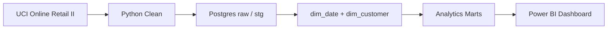

# Retail Retention & Revenue Intelligence

[](https://github.com/rmarathe-hub/retail-retention-revenue-intel/actions/workflows/ci.yml)

**Portfolio case study** — end-to-end retention and revenue analytics on **1,067,371** real UCI Online Retail II transactions (Dec 2009 – Dec 2011) for a UK giftware retailer.

Built with **Python**, **SQL**, **Postgres**, and **Power BI** to answer: *Who returns? Who goes inactive? Where is revenue concentrated? What should marketing and leadership do next?*

| | |
|---|---|
| **Dataset** | [UCI Online Retail II](https://archive.ics.uci.edu/dataset/502/online+retail+ii) |
| **Valid customers** | 5,881 (non-null ID, ≥1 non-canceled order) |
| **Customer-attributed revenue** | £17,685,460.64 |
| **SQL marts** | 8 populated tables · 27 automated data quality checks |
| **Tests** | 1,000+ pytest cases · [GitHub Actions CI](docs/ci.md) on every push |
| **Dashboard** | 6-page Power BI model (build guide + CSV exports ready) |

---

## Case Study

### Business problem

A UK online retailer had years of transaction history but no unified view of **retention**, **segment value**, or **revenue at risk**. Leadership needed evidence-backed priorities for win-back campaigns, loyalty programs, and international growth — not another one-off chart deck.

### Approach

1. **Ingest & profile** — 1M+ raw rows; documented 22.77% missing customer IDs, cancellations, returns, duplicates  
2. **Clean & load** — Python deduplication and flagging → Docker Postgres (`localhost:5433`) → `stg_transactions` + dims  
3. **Model in SQL** — Eight analytical marts (cohort retention, RFM segmentation, revenue-at-risk, product/market) with locked definitions in [docs/metric_definitions.md](docs/metric_definitions.md)  
4. **Validate** — `python scripts/validate_data.py` runs 27 SQL data quality checks  
5. **Visualize** — Export marts to CSV → 6-page executive dashboard ([build guide](docs/powerbi_dashboard_guide.md))

**Data lineage:** `raw` → `stg_transactions` → `dim_*` → `mart_*` → Power BI



### Results

Locked metrics (reference date **2011-12-09**):

| Theme | Finding |
|-------|---------|
| **Repeat behavior** | **72.35%** of attributable customers made 2+ non-canceled orders |
| **Cohort retention** | Month-3 retention **21.61%**; month-3 revenue retention **26.44%** |
| **RFM segments** | **1,343 Champions** · **543 At Risk** among 5,881 valid customers |
| **Revenue concentration** | Top **10%** of customers → **64.04%** of customer-attributed revenue |
| **Inactive high-value** | **291** customers · **£1,791,355** historical spend at risk · **£179,135.53** recoverable (10% scenario) |
| **Product & market** | Top SKU **22423** → **£344,069** · **85.06%** of country-mart revenue in United Kingdom |
| **Data quality** | **1.84%** cancellation line rate on staging transactions |

Full methodology: [cohort](docs/cohort_analysis_notes.md) · [RFM](docs/rfm_analysis_notes.md) · [at-risk](docs/revenue_at_risk_notes.md) · [product/market](docs/product_market_notes.md)

### Recommended actions

Prioritized initiatives with estimated £ impact — [docs/recommendations.md](docs/recommendations.md):

1. **Win-back** inactive high-value customers → **£179,136** (10% reactivation scenario)  
2. **VIP retention** for Champions + Cannot Lose Them → **£540,000+** defended  
3. **First-90-day nurture** for one-time buyers → **£380,000+** incremental LTV  
4. **Product cancellation** root-cause on high-cancel SKUs → **£50K–£100K** leakage reduction  
5. **International growth** (DE / FR / NL) → **£115,000+** (5% non-UK uplift)

---

## Dashboard Preview

**Build guide:** [docs/powerbi_dashboard_guide.md](docs/powerbi_dashboard_guide.md)  
**Data:** `python scripts/export_powerbi_marts.py` → `data/marts/*.csv`

| Page | Focus | Guide status |
|------|--------|--------------|
| 1 | Executive Revenue Overview | Guide + CSV exports ready |
| 2 | Cohort Retention | Guide + CSV exports ready |
| 3 | RFM Customer Segmentation | Guide + CSV exports ready |
| 4 | Revenue Concentration & At-Risk Customers | Guide + CSV exports ready |
| 5 | Product & Market Performance | Guide + CSV exports ready |
| 6 | Retention Action Plan | Guide + CSV exports ready |

### Screenshots

Add PNG exports after building in Power BI Desktop. Paths (see [dashboard/screenshots/README.md](dashboard/screenshots/README.md)):

| Page | File | Status |
|------|------|--------|
| 1 — Executive | `dashboard/screenshots/page1_executive_overview.png` | Add after Power BI Desktop build |
| 2 — Cohort | `dashboard/screenshots/page2_cohort_retention.png` | Add after Power BI Desktop build |
| 3 — RFM | `dashboard/screenshots/page3_rfm_segmentation.png` | Add after Power BI Desktop build |
| 4 — At-risk | `dashboard/screenshots/page4_revenue_at_risk.png` | Add after Power BI Desktop build |
| 5 — Product/market | `dashboard/screenshots/page5_product_market.png` | Add after Power BI Desktop build |
| 6 — Action plan | `dashboard/screenshots/page6_action_plan.png` | Add after Power BI Desktop build |

When screenshots exist, embed in this README:

```markdown

```

---

## Tech Stack

- **Python** — ingest, clean, validate, export marts  
- **SQL** — analytical logic (25+ queries across 8 mart scripts)  
- **Postgres** — Docker data warehouse on host port **5433**  
- **Power BI** — 6-page executive dashboard  
- **pytest** — 1,000+ automated contract and integration tests ([CI](docs/ci.md): `not db and not network and not data`)  
- **GitHub** — [retail-retention-revenue-intel](https://github.com/rmarathe-hub/retail-retention-revenue-intel)

---

## Data Quality

Messy real-world data handled explicitly:

- **243,007 rows (22.77%)** missing customer IDs  
- **19,494** canceled invoice lines · **22,950** return lines · **12,133** duplicates  
- Cleaning: `scripts/clean_online_retail.py` → 1,055,238 deduplicated rows  

Details: [data_quality_report.md](docs/data_quality_report.md) · [data_dictionary.md](docs/data_dictionary.md)  
Raw and processed data files are **gitignored** locally; run the pipeline above to regenerate.

---

## How to Reproduce

```bash
git clone https://github.com/rmarathe-hub/retail-retention-revenue-intel.git
cd retail-retention-revenue-intel
python -m venv .venv
source .venv/bin/activate
pip install -r requirements.txt

cp .env.example .env
docker compose up -d
docker compose exec postgres pg_isready -U retail_user -d retail_analytics

python scripts/download_or_import_data.py
python scripts/profile_raw_data.py
python scripts/clean_online_retail.py
python scripts/load_to_postgres.py
python scripts/validate_data.py

python scripts/run_kpi_marts.py
python scripts/run_cohort_retention.py
python scripts/run_rfm_segmentation.py
python scripts/run_revenue_at_risk.py
python scripts/run_product_market_analysis.py
python scripts/export_powerbi_marts.py

pytest -q -m "db"
```

**CI (GitHub Actions):** `pytest -q -m "not db and not network and not data"` — see [docs/ci.md](docs/ci.md).

Postgres setup: [docs/postgres_setup.md](docs/postgres_setup.md) (host **5433**, not 5432).

---

## SQL Marts

| File | Mart(s) |
|------|---------|
| `03_kpi_definitions.sql` | `mart_executive_kpis` |
| `04_revenue_analysis.sql` | `mart_monthly_revenue`, `mart_customer_orders` |
| `05_cohort_retention.sql` | `mart_cohort_retention` |
| `06_rfm_segmentation.sql` | `mart_customer_rfm` |
| `07_revenue_at_risk.sql` | `mart_revenue_at_risk` |
| `08_product_market_analysis.sql` | `mart_product_performance`, `mart_country_performance` |

Validation: `02_data_quality_checks.sql` via `validate_data.py`

---

## Documentation

| Doc | Purpose |
|-----|---------|
| [portfolio_case_study.md](docs/portfolio_case_study.md) | Interview-ready STAR narrative |
| [ci.md](docs/ci.md) | GitHub Actions and local test matrix |
| [business_problem.md](docs/business_problem.md) | Stakeholders and success criteria |
| [metric_definitions.md](docs/metric_definitions.md) | Locked KPI and mart definitions |
| [recommendations.md](docs/recommendations.md) | Prioritized actions with £ impact |
| [powerbi_dashboard_guide.md](docs/powerbi_dashboard_guide.md) | Page-by-page dashboard build |
| [postgres_setup.md](docs/postgres_setup.md) | Docker and connection details |

---

## License

Portfolio / educational use. Dataset © UCI Machine Learning Repository — see UCI terms for Online Retail II.
